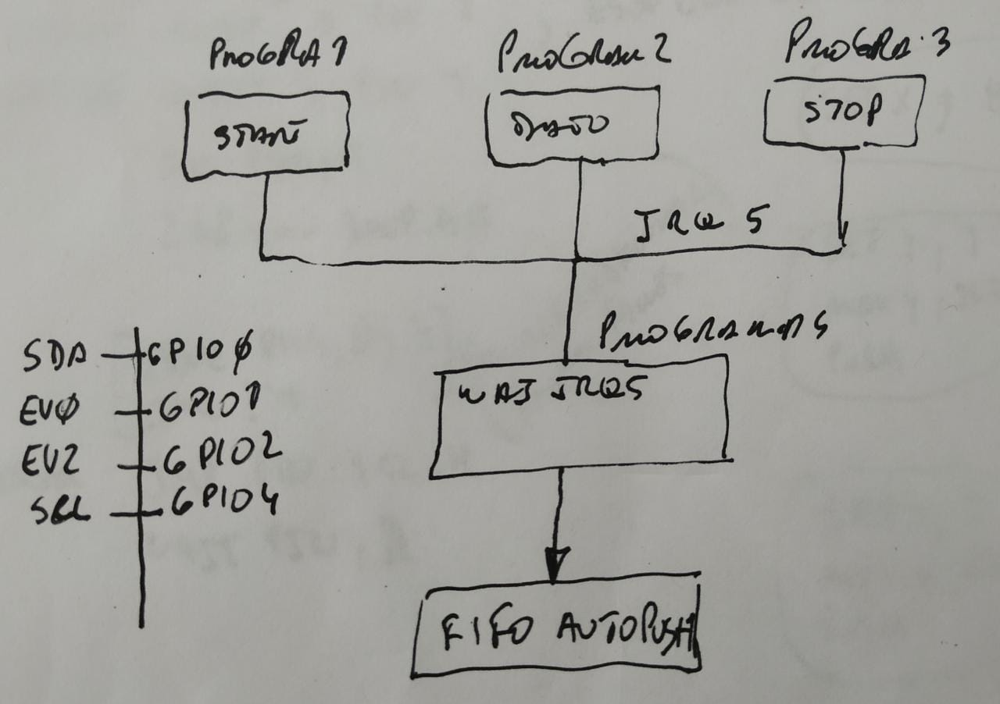
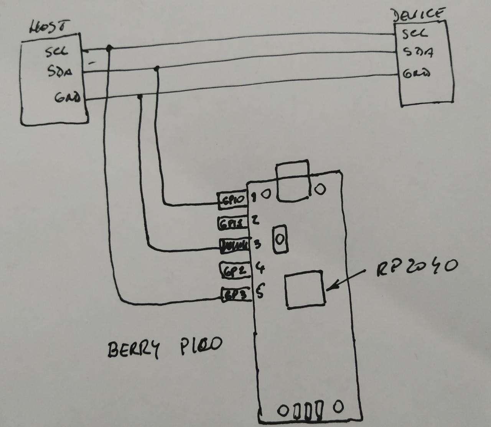
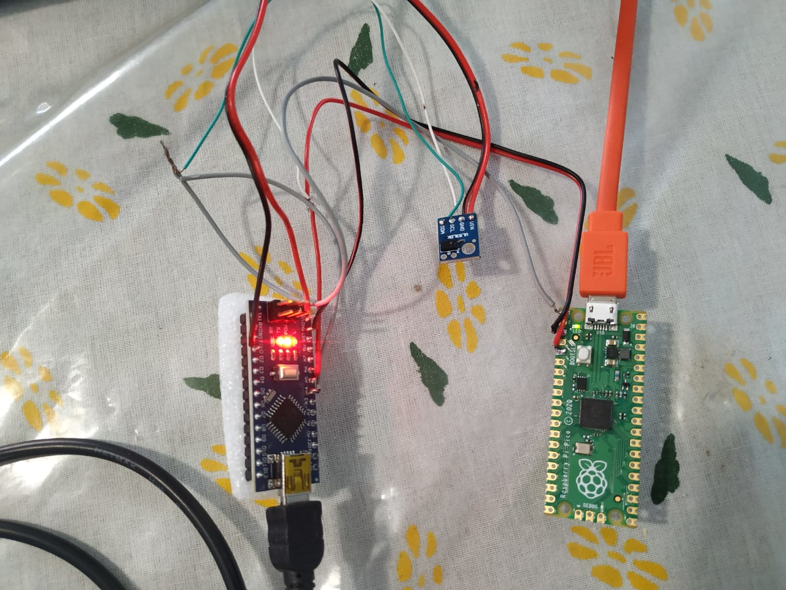
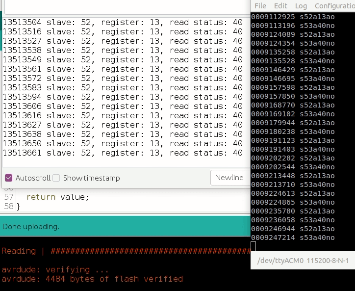

# I2C sniffer - RP2040 - PICO

The purpose of this project is to develop a sniffer for the I2C BUS that can capture at 400 KHZ. For 100 Khz, optimizing the code it is possible to use by polling an 8-bit or 32-bit processor, but for 400 Khz it is necessary to react in less than 2 uS, so CPLD or FPGA are required. A middle way is to use the processor [RP2040](https://www.raspberrypi.org/products/raspberry-pi-pico/) that has the PIO unit that, with its own ASM, executes instructions in one cycle independent of central CPUs.

## I2C protocol

A reduction of the i2c working principle could be that there are three conditions to detect: START  DATA and STOP and that when the level of the clock pin (SCL) is high, the transitions of the data pin (SCD) indicate start or stop, but if it remains stable is a valid data bit.

## Principle of operation with the PIO unit

Each PIO has 4 state machines that can be programmed to decode a part of the protocol and use an irq to communicate. 

For example, SM0 runs the program that decodes the START condition and triggers IRQ 7 that SM 3 listens to, which runs the main program that is waiting for the IRQs to PUSH the data in the transmission FIFO.

### Sniffer data encoding.

When the main state machine inserts data into the FIFO, it encodes it as follows: the least significant nines are reserved for the address or data that is made up of 8 bits plus the ack / nack, and bits 11 and 12 encode the code event.

### Connection diagram

The sniffer connection to the I2C bus is as follows: the SDA line connects to the GPIO, the SCL line to the GPIO3 and the GND is shared.

NOTE: the bus is 3.3V logic.

### Test scenario 

To test the capture, an arduino nano was used as a host that requests the status of a VL530 TOF every 10 mS on a 400 Khz i2c BUS..

### Preliminary results
The following video shows the arduino monitor consulting the status, and the serial console that sends the result of the sniff of the i2c bus.
Note: Given the nature of the test, it has not been possible to check for loss of frames or data.

