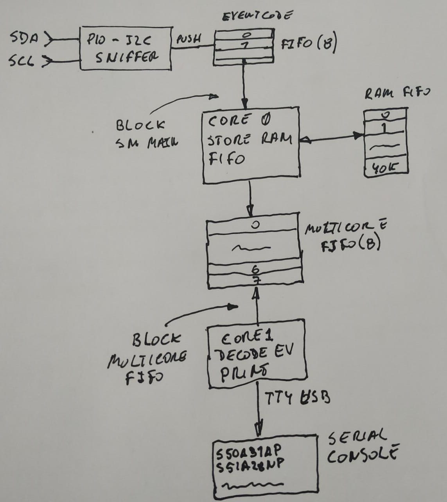

# I2C sniffer - RP2040 - PICO

The purpose of this project is to develop a sniffer for the I2C BUS that can capture at 400 KHZ. For 100 Khz, optimizing the code it is possible to use by polling an 8-bit or 32-bit processor, but for 400 Khz it is necessary to react in less than 2 uS, so CPLD or FPGA are required. A middle way is to use the processor [RP2040](https://www.raspberrypi.org/products/raspberry-pi-pico/) that has the PIO unit that, with its own ASM, executes instructions in one cycle independent of central CPUs.

## I2C protocol

A reduction of the i2c working principle could be that there are three conditions to detect: START DATA and STOP. And when the level of the clock pin (SCL) is high, the transitions of the data pin (SDA) indicate start or stop, but if it remains stable is a valid data bit.

## Principle of operation with the PIO unit

Each PIO has 4 state machines that can be programmed to decode a part of the protocol and use an irq to communicate. 

For example, SM0 runs the program that decodes the START condition and triggers IRQ 7 that SM 3 listens to, which runs the main program that is waiting for the IRQs to PUSH the data in the transmission FIFO.

### Sniffer data encoding.

When the main state machine inserts data into the FIFO, it encodes it as follows: the least significant nines are reserved for the address or data that is made up of 8 bits plus the ack / nack, and bits 11 and 12 encode the code event.

### Connection diagram

The sniffer connection to the I2C bus is as follows: the SDA line connects to the GPIO, the SCL line to the GPIO3 and the GND is shared.

NOTE: the bus is 3.3V logic.

## Firmware description

Although each state machine has an 8-level fifo, it was decided to take advantage of the fact that the pico has two CPUs, and dedicate CORE0 to wait for the i2c events from the main state machine and communicate them to CORE1 through the multicore fifo of 8 levels; so that it decodes them and sends them through the USB serial port to a console.

To increase the level of FIFOs, one was implemented in RAM (40K events) controlled by CORE0 for buffering when the multicore FIFO is full.

## Ascii event encoding

The ascii output is a succession of events in the sequence in which they were detected by the sniffer. It must be assumed that the slave address is the one immediately after the START event, and that after the 8 bits encoded in ascii the ack / nack bit continues. 
To improve readability, a CR LF is added each time the STOP condition is detected.

`s = START CONDITION`
`o = STOP CONDITION`
`a = ACK DETECTED`
`n = NAK DETECTED`

Below is an excerpt of the command to get range from the VL530X sensor using the [Pololu Arduino library](https://github.com/pololu/vl53l0x-arduino/blob/master/VL53L0X.cpp). 

    Capture         Source Code
    -------         -------------
    s52a13ao    -   readReg(RESULT_INTERRUPT_STATUS)
    s53a40no    -   status = 40
    s52a13ao    -   readReg(RESULT_INTERRUPT_STATUS)
    s53a44no    -   status = 44
    s52a1Eao    -   readReg16Bit(RESULT_RANGE_STATUS + 10);
    s53a08a05no -   range = 0805
    s52a0Ba01ao -   writeReg(SYSTEM_INTERRUPT_CLEAR, 0x01);
    s52a80a01ao -   writeReg(0x80, 0x01);
    s52aFFa01ao -   writeReg(0xFF, 0x01);
    s52a00a00ao -   writeReg(0x00, 0x00);
    s52a91a3Cao -   writeReg(0x91, stop_variable);
    s52a00a01ao -   writeReg(0x00, 0x01);
    s52aFFa00ao -   writeReg(0xFF, 0x00);
    s52a80a00ao -   writeReg(0x80, 0x00);
    s52a00a01ao -   writeReg(SYSRANGE_START, 0x01);
    s52a00ao    -   readReg(SYSRANGE_START)
    s53a00no    -   answer = 00

### Test scenario 

To test the capture, an arduino nano was used as a host that requests the status of a VL530 TOF every 10 mS on a 400 Khz i2c BUS..

### Preliminary results

The following video shows the arduino monitor consulting the status, and the serial console that sends the result of the sniff of the i2c bus.
Note: Given the nature of the test, it has not been possible to check for loss of frames or data.

### TinyUSB - serial console

To make the usb port behave like a serial port (CDC) pico uses the TinyUSB library, and with the option pico_enable_stdio_usb ($ {PROJECT_NAME} 1) it is integrated into the output console (printf).
For this case, the conversions (% c% x% s) add a lot of delay, so it was decided to do the conversion locally by nibbles.
To further optimize speed, MUTEX and CR and LF conversion were disabled with PUBLIC PICO_STDOUT_MUTEX = 0 PICO_STDIO_ENABLE_CRLF_SUPPORT = 0.

## Print using buffered string

When the output is via USB CDC, the data is sent in packets of maximum 64 bytes every 1mS. As the decoding of the i2c frame is composed of more than one event (Start / Stop / Data) that are separated by a few uS, to optimize the output they are stored in buffer waiting for: STOP, the buffer is full, or that elapsed more than 100 uS since the last event.

### Led indicator

The LED is used to indicate that the board has initialized successfully (ON), flashes when there is activity on the i2c bus, and turns off when it detects a RAM overflow.